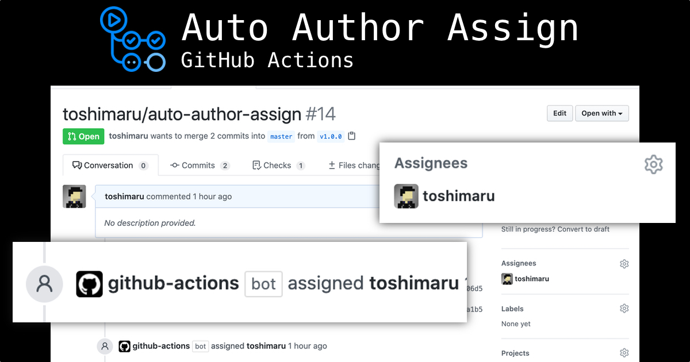

[](https://github.com/toshimaru/auto-author-assign/actions/workflows/build.yml)

# auto-author-assign

GitHub Actions: Assign pull request author automatically.



## Why this action?

In most cases, pull request author should be assigned an assignee of the pull request.

This action automatically assigns PR author as an assignee.

## Usage

```yml
# .github/workflows/auto-author-assign.yml
name: Auto Author Assign

on:
  issues:
    types: [ opened, assigned ]
  pull_request_target:
    types: [ opened, reopened ]

permissions:
  pull-requests: write

jobs:
  assign-author:
    runs-on: ubuntu-latest
    steps:
      - uses: toshimaru/auto-author-assign@v1.5.0
```

## Use your token

You can specify your own token.

```yml
jobs:
  assign-author:
    runs-on: ubuntu-latest
    steps:
      - uses: toshimaru/auto-author-assign
        with:
          repo-token: ${{ secrets.YOUR_TOKEN }}
```

If not specified, `GITHUB_TOKEN` will be used by default.

## Skip assigning author

`auto-author-assign` action skips assigning the author when:

- Someone is already assigned as an assignee
- The author is a bot
